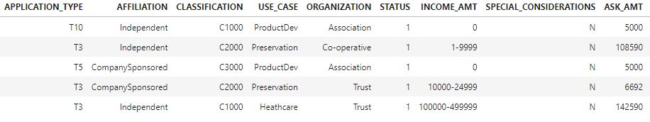

# Neural Network Charity Analysis
Module 19: Neural Networks and Deep Learning Models

## Overview of the analysis
Using my knowledge of machine learning and neural networks, We provided Bek's a binary classifier that is capable of predicting whether applicants will be successful if funded by Alphabet Soup. The sample file we received contains over 34,000 organizations that have received funding from Alphabet Soup over the years.

# Resources

Jupyter Files: [AlphabetSoupCharity.ipynb](notebooks/AlphabetSoupCharity.ipynb) ,  [AlphabetSoupCharity_Optimization.ipynb](notebooks/AlphabetSoupCharity_Optimization.ipynb) 

DataSources: [charity_data.csv](Resources/charity_data.csv)  [AlphabetSoupCharity.h5](notebooks/AlphabetSoupCharity.h5)  [AlphabetSoupCharityOptimized.h5](notebooks/AlphabetSoupCharityOptimized.h5) 

Results:  [AlphabetSoupCharity.html](Resources/AlphabetSoupCharity.html)  [AlphabetSoupCharity_Optimization.html](Resources/AlphabetSoupCharity_Optimization.html) 

## Results
Using bulleted lists and images to support your answers, address the following questions.

- Data Preprocessing
  - The variable be considered for the target of the model is IS_SUCCESSFUL 
  
  - A feature is a measurable property of the object you’re trying to analyze
    
  
    The features we are looking for are APPLICATION_TYPE, AFFILIATION, CLASSIFICATION, USE_CASE, ORGANIZATION, (STATUS), INCOME_AMT, SPECIAL_CONSIDERATIONS, ASK_AMT.
  
  - EIN and NAME are variables that are neither targets nor features, and should be removed from the input data. In our Optimization, we attempted to remove STATUS as well.
- Compiling, Training, and Evaluating the Model
  - Our Original model ran with 43 input features with two hidden layers consisting of 80 Neurons and 30 Neurons respectively.
  
    1) These numbers were used to calculate  **43** *features*  ***** **80** *1st hidden layer* **+** **80** *1st hidden layer* **=**  **3520** *Dense layer 0*
  
    2) These numbers were used to calculate  **80** *1st hidden layer* ***** **30** *2nd hidden layer*  + **30** *2nd hidden layer* **=  3520**** *Dense layer 1*

    3) These numbers were used to calculate  **30** *2nd hidden layer* **+** **1** =  **31** *Dense layer 2* to equal  5,981 params
    
  
  - The Target for the model was 75%, however we were not able to achieve that, scoring 72.57%  
  
  
  - Some further steps I took to optimizing was allowing more applications, by binning a lower number of values (from counts of 200 and less to just 100 and less and adding T9 as a standalone value for Application Type with 156 types and reducing the other to 120 types)
  
  
  - We further reduced the binning count for Classification from 1000 unique types counts and less to 300 and less, adding C7000 for count 777 while reducing Other counts from 2261 to 1484.
  
  - The Model added a third hidden layer with 10 Neurons , and change all steps to use sigmoid for an attempt to have a higher accuracy (it was found increasing the 1st and 2nd Hidden layer did not help with increasing our accuracy initially).
  
  - We achieved an accuracy mark of 72.72% which slightly better than our original model, with an improvement of loss by just 0.26% which is small considering the processing effort
    

## Summary
With the provided data set, our models mostly ended up being approximately 75.5% accurate. With the current dataset, and slight changes in binning technique are dropping one column, we failed to improve the score with the contents of the current dataset to beyond 76% and into the ranges of as close to 100% as we can get.

Therefore the dataset we need needs to have more information. Perhaps a date, country, Charity budget, expenditures, and outreach numbers are some data points that come to mind that could help us improve the accuracy of or model.
